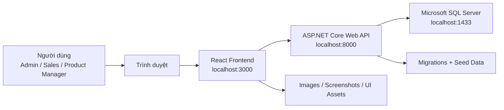
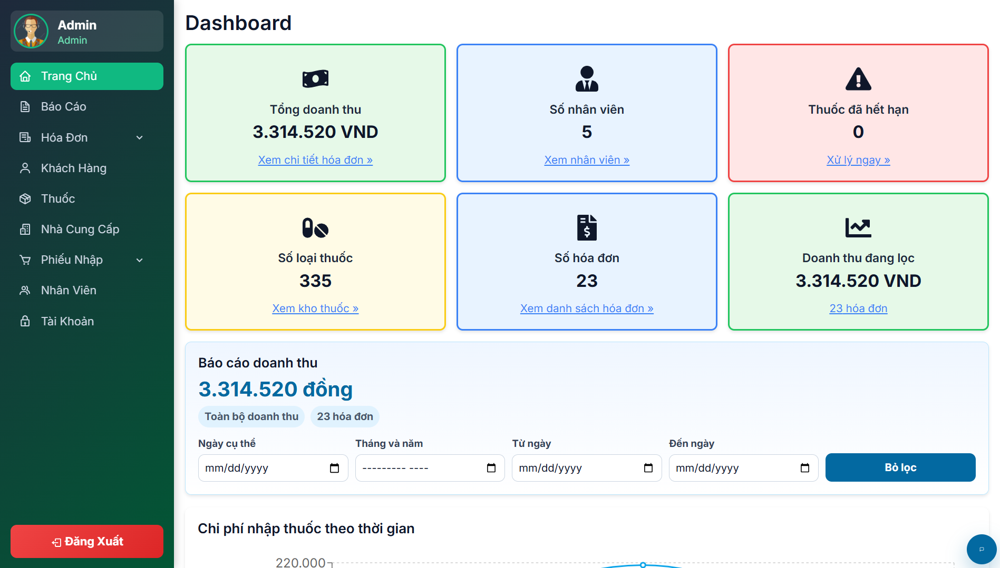
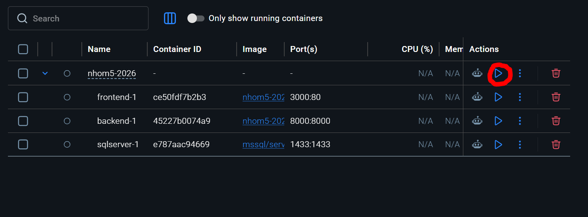

<div align="center">
  

  <h1>PHARMACY-MANAGEMENT-WEB APP</h1>

  <p><strong>Web App quản lý nhà thuốc dành cho dược sĩ, nhân viên bán hàng và quản lý</strong></p>

  <p>
    
    
    
    
    
    
  </p>
</div>

## Đồ án thực tế công nghệ phần mềm

PharmaCare là Web App quản lý nhà thuốc, hỗ trợ các nghiệp vụ thường gặp như đăng nhập theo vai trò, quản lý thuốc, khách hàng, nhân viên, tài khoản, nhà cung cấp, phiếu nhập, hóa đơn, báo cáo doanh thu và trợ lý hướng dẫn sử dụng. Dự án được xây dựng theo mô hình frontend React, backend ASP.NET Core Web API và cơ sở dữ liệu Microsoft SQL Server, có Docker Compose để chạy toàn bộ hệ thống nhanh trên máy local.


## Giới thiệu dự án

### Mục đích của dự án

- Xây dựng một hệ thống quản lý nhà thuốc trực quan, dễ thao tác và phù hợp với môi trường học tập, demo, nghiệm thu đồ án.
- Chuẩn hóa các quy trình cơ bản trong nhà thuốc: quản lý kho thuốc, bán hàng, nhập hàng, khách hàng, nhân viên và báo cáo.
- Tạo nền tảng có thể mở rộng thêm các chức năng như cảnh báo tồn kho, quản lý hạn sử dụng, lịch sử giao dịch, phân quyền nâng cao và tích hợp thanh toán.

### Vấn đề dự án giải quyết

- Giảm thao tác quản lý thủ công bằng sổ sách hoặc bảng tính rời rạc.
- Hạn chế sai sót khi bán thuốc vượt tồn kho hoặc nhập dữ liệu thiếu.
- Giúp nhân viên bán hàng tạo hóa đơn nhanh, quản lý kiểm tra báo cáo, và nhân viên kho theo dõi phiếu nhập thuận tiện hơn.
- Tách frontend, backend và database rõ ràng để dễ bảo trì, kiểm thử và triển khai bằng Docker.

### Đối tượng người dùng chính

- **Dược sĩ/Nhân viên bán hàng:** tạo hóa đơn, tra cứu thuốc, nhập thông tin khách hàng.
- **Nhân viên quản lý sản phẩm/kho:** quản lý thuốc, nhà cung cấp, phiếu nhập và tồn kho.
- **Quản lý/Admin:** quản lý tài khoản, nhân viên, báo cáo, dashboard và dữ liệu tổng quan.

## Tính năng chính

- Đăng nhập, đăng xuất và điều hướng theo vai trò.
- Quản lý tài khoản người dùng và trạng thái hoạt động.
- Quản lý nhân viên, khách hàng, nhà cung cấp.
- Quản lý thuốc, hình ảnh thuốc, tồn kho, đơn giá và nhóm thuốc.
- Tìm kiếm, lọc dữ liệu và xem danh sách theo bảng.
- Thêm, sửa, xóa dữ liệu ở các màn hình nghiệp vụ.
- Tạo hóa đơn bán thuốc, kiểm tra giỏ hàng và in/lưu hóa đơn.
- Tạo phiếu nhập, cộng tồn kho sau nhập hàng.
- Trừ tồn kho sau bán hàng và kiểm tra không bán vượt tồn.
- Báo cáo, thống kê và xuất dữ liệu.
- Phân quyền giao diện theo Admin, Sales và Product_manager.
- Chatbot hướng dẫn sử dụng hệ thống dựa trên tài liệu nội bộ.

## Tải xuống & Cài đặt nhanh

### Cách 1: Tải ZIP từ GitHub

1. Mở repo GitHub của dự án.
2. Bấm **Code**.
3. Chọn **Download ZIP**.
4. Giải nén file ZIP.
5. Mở Terminal/PowerShell tại thư mục có file `docker-compose.yml`.

### Cách 2: Clone bằng Git

```powershell
git clone https://github.com/khainhq/PHARMACY-MANAGEMENT-webapp.git
cd PHARMACY-MANAGEMENT-webapp
```

### Chạy nhanh bằng Docker Compose

```powershell
docker compose up -d --build
```

Sau khi chạy xong:

- Frontend: [http://localhost:3000](http://localhost:3000)
- Backend API: [http://127.0.0.1:8000](http://127.0.0.1:8000)
- Swagger: [http://127.0.0.1:8000/swagger](http://127.0.0.1:8000/swagger)
- SQL Server: `localhost,1433`

## Công nghệ sử dụng (Tech Stack)

| Thành phần | Công nghệ / Thư viện | Vai trò |
|---|---|---|
| Frontend | React, React Router, Axios, Styled Components, MUI, Chart.js, Recharts | Xây dựng giao diện, điều hướng, biểu mẫu, dashboard, bảng dữ liệu và biểu đồ |
| Backend | C#, ASP.NET Core Web API, Entity Framework Core, BCrypt.Net | Cung cấp REST API, xử lý nghiệp vụ, xác thực, hash mật khẩu, cập nhật tồn kho |
| Database | Microsoft SQL Server | Lưu trữ tài khoản, thuốc, khách hàng, nhân viên, nhà cung cấp, hóa đơn, phiếu nhập |
| DevOps/Runtime | Docker, Docker Compose, Nginx | Đóng gói và chạy frontend, backend, SQL Server bằng một lệnh |
| Documentation | Swagger/OpenAPI, Markdown, PDF | Tài liệu API, hướng dẫn cài đặt và sử dụng |
| Testing | Jest, React Testing Library, dotnet build | Kiểm thử frontend và kiểm tra build backend |

## Kiến trúc hệ thống (Architecture)



Luồng chính:

1. Người dùng đăng nhập từ frontend.
2. Frontend gửi request đến backend API.
3. Backend xác thực tài khoản, hash/verify mật khẩu bằng BCrypt và trả token.
4. Frontend dùng token để gọi các API nghiệp vụ.
5. Backend đọc/ghi dữ liệu trong SQL Server thông qua Entity Framework Core.

## Cấu trúc dự án

```text
PHARMACY-MANAGEMENT-webapp/
├── backend/                 # ASP.NET Core Web API
│   ├── Migrations/          # EF Core migrations
│   ├── SeedData/            # Dữ liệu mẫu dùng khi seed database
│   ├── Docs/                # Tài liệu nội bộ cho chatbot
│   ├── DataSeeder.cs        # Tạo dữ liệu demo, tài khoản demo, thuốc mẫu
│   ├── Program.cs           # API endpoints và cấu hình backend
│   └── Dockerfile
├── frontend/                # React frontend
│   ├── public/images/       # Logo, hero images, ảnh thuốc, assets
│   └── src/                 # Components, pages, services, tests
├── database/                # Script SQL và dữ liệu mẫu bàn giao
├── docs/                    # API docs và PDF hướng dẫn
├── screenshots/             # Ảnh demo giao diện
├── docker-compose.yml       # Chạy frontend + backend + SQL Server
└── PharmacyManagement.sln   # Solution .NET
```

## Hướng dẫn cài đặt

### Yêu cầu

- Docker Desktop.
- Git hoặc khả năng tải ZIP từ GitHub.
- Cổng `3000`, `8000`, `1433` chưa bị ứng dụng khác chiếm dụng.

### Các bước chạy

```powershell
docker compose up -d --build
```

Kiểm tra container:

```powershell
docker compose ps
```

Xem log backend nếu có lỗi:

```powershell
docker compose logs backend
```

Dừng hệ thống:

```powershell
docker compose down
```

Reset database demo:

```powershell
docker compose down -v
docker compose up -d --build
```

> Lưu ý: `docker compose down -v` sẽ xóa volume SQL Server, dùng khi muốn tạo lại database demo từ đầu.

## Một số hình ảnh Demo

### Trang chủ và trợ lý nhà thuốc

<table>
  <tr>
    <td align="center" width="50%">
      
      <br />
      <sub>Trang chủ PharmaCare</sub>
    </td>
    <td align="center" width="50%">
      
      <br />
      <sub>Trợ lý nhà thuốc</sub>
    </td>
  </tr>
</table>

### Đăng nhập theo vai trò

<table>
  <tr>
    <td align="center" width="50%">
      
      <br />
      <sub>Đăng nhập Admin</sub>
    </td>
    <td align="center" width="50%">
      
      <br />
      <sub>Đăng nhập nhân viên</sub>
    </td>
  </tr>
</table>

### Dashboard và tài khoản

<table>
  <tr>
    <td align="center" width="50%">
      
      <br />
      <sub>Dashboard quản trị</sub>
    </td>
    <td align="center" width="50%">
      
      <br />
      <sub>Danh sách tài khoản</sub>
    </td>
  </tr>
</table>

### Nhân viên và phân quyền màn hình

<table>
  <tr>
    <td align="center" width="50%">
      
      <br />
      <sub>Quản lý nhân viên</sub>
    </td>
    <td align="center" width="50%">
      
      <br />
      <sub>Giao diện nhân viên bán hàng</sub>
    </td>
  </tr>
</table>

<table>
  <tr>
    <td align="center" width="50%">
      
      <br />
      <sub>Giao diện nhân viên quản lý sản phẩm</sub>
    </td>
    <td align="center" width="50%">
      
      <br />
      <sub>Quản lý khách hàng</sub>
    </td>
  </tr>
</table>

### Thuốc, nhà cung cấp và phiếu nhập

<table>
  <tr>
    <td align="center" width="50%">
      
      <br />
      <sub>Quản lý thuốc</sub>
    </td>
    <td align="center" width="50%">
      
      <br />
      <sub>Quản lý nhà cung cấp</sub>
    </td>
  </tr>
</table>

<table>
  <tr>
    <td align="center" width="50%">
      
      <br />
      <sub>Tạo phiếu nhập</sub>
    </td>
    <td align="center" width="50%">
      
      <br />
      <sub>Danh sách phiếu nhập</sub>
    </td>
  </tr>
</table>

### Hóa đơn, in hóa đơn và báo cáo

<table>
  <tr>
    <td align="center" width="50%">
      
      <br />
      <sub>Tạo hóa đơn</sub>
    </td>
    <td align="center" width="50%">
      
      <br />
      <sub>Danh sách hóa đơn</sub>
    </td>
  </tr>
</table>

<table>
  <tr>
    <td align="center" width="50%">
      
      <br />
      <sub>Ảnh hóa đơn</sub>
    </td>
    <td align="center" width="50%">
      
      <br />
      <sub>Ảnh hóa đơn được in</sub>
    </td>
  </tr>
</table>

<table>
  <tr>
    <td align="center" width="50%">
      
      <br />
      <sub>Báo cáo thống kê</sub>
    </td>
    <td align="center" width="50%">
      
      <br />
      <sub>Docker containers đang chạy</sub>
    </td>
  </tr>
</table>

## Vai trò người dùng

| Vai trò | Tài khoản demo | Chức năng chính |
|---|---|---|
| Admin | `admin / admin123` | Dashboard, quản lý tài khoản, nhân viên, thuốc, khách hàng, nhà cung cấp, hóa đơn, phiếu nhập, báo cáo |
| Sales | `sales / sales123` | Bán thuốc, tạo hóa đơn, quản lý khách hàng, tra cứu thuốc |
| Product_manager | `product / product123` | Quản lý thuốc, nhà cung cấp, phiếu nhập, tồn kho |

## Database

- Database sử dụng: **Microsoft SQL Server**.
- Backend tự chạy migrations khi container khởi động.
- Dữ liệu demo được seed trong `backend/DataSeeder.cs`.
- Dữ liệu thuốc mẫu nằm trong `backend/SeedData/medicine-products.json`.
- Thư mục `database/` chứa script SQL và dữ liệu mẫu để tham khảo/bàn giao:
  - `database/PharmacyManagement.sql`
  - `database/seed/medicine-products.json`
  - `database/HUONG_DAN_DATABASE.txt`

## API Documentation

Tài liệu API nằm trong thư mục `docs/`:

- [Auth API](./docs/auth_api.md)
- [Medicines API](./docs/medicines_api.md)
- [Sales API](./docs/sales_api.md)
- [Swagger Guide](./docs/swagger_api.md)
- [PDF hướng dẫn cài đặt và sử dụng](./docs/TAI_LIEU_HUONG_DAN_CAI_DAT_VA_SU_DUNG_PHARMACY_MANAGEMENT_WEB_APP.pdf)

Khi backend đang chạy, có thể mở Swagger tại:

```text
http://127.0.0.1:8000/swagger
```

## Biến môi trường

Khi chạy bằng Docker Compose, các biến môi trường chính đã được cấu hình trong `docker-compose.yml`.

| Biến môi trường | Giá trị trong Docker | Mục đích |
|---|---|---|
| `ASPNETCORE_URLS` | `http://+:8000` | Cho backend lắng nghe ở port 8000 |
| `ConnectionStrings__DefaultConnection` | Kết nối tới service `sqlserver` | Backend kết nối SQL Server trong Docker |
| `ACCEPT_EULA` | `Y` | Chấp nhận điều khoản SQL Server container |
| `MSSQL_SA_PASSWORD` | Mật khẩu demo trong Docker Compose | Mật khẩu tài khoản `sa` của SQL Server container |

> Không push API key thật hoặc secret cá nhân lên repository.

## Tài khoản demo

Backend sẽ tự đảm bảo các tài khoản demo sau luôn tồn tại, đang hoạt động và có đúng mật khẩu khi khởi động:

```text
Admin:            admin / admin123
Nhân viên bán hàng: sales / sales123
Quản lý sản phẩm:   product / product123
```

## Hướng dẫn sử dụng

### Admin

1. Vào `/admin-login`.
2. Đăng nhập bằng `admin / admin123`.
3. Kiểm tra dashboard.
4. Quản lý tài khoản, nhân viên, thuốc, khách hàng, nhà cung cấp, hóa đơn, phiếu nhập và báo cáo.

### Nhân viên bán hàng

1. Vào `/login`.
2. Đăng nhập bằng `sales / sales123`.
3. Tạo hóa đơn bán thuốc.
4. Thêm thuốc vào giỏ hàng, nhập thông tin khách hàng và lưu hóa đơn.

### Nhân viên quản lý sản phẩm

1. Vào `/login`.
2. Đăng nhập bằng `product / product123`.
3. Quản lý danh sách thuốc, nhà cung cấp và phiếu nhập.
4. Theo dõi tồn kho sau nhập hàng.

## Kiểm thử

### Kiểm tra backend

```powershell
dotnet build backend\PharmacyManagement.Api.csproj
```

### Kiểm tra frontend

```powershell
cd frontend
npm test
```

### Kiểm tra Docker

```powershell
docker compose up -d --build
docker compose ps
```

## Bảo mật

- Mật khẩu tài khoản được hash bằng BCrypt.
- Không lưu plaintext password trong database.
- Các API quan trọng yêu cầu token đăng nhập.
- Frontend không chứa mật khẩu thật.
- Backend kiểm tra dữ liệu đầu vào cho các nghiệp vụ quan trọng như số điện thoại, số lượng, giá nhập và tồn kho.
- Docker Compose hiện dùng cấu hình demo/local; khi triển khai thật nên đổi mật khẩu SQL Server, dùng biến môi trường riêng, bật HTTPS và giới hạn CORS theo domain thật.

## Triển khai

### Local bằng Docker

```powershell
docker compose up -d --build
```

### Build frontend riêng

```powershell
cd frontend
npm install
npm run build
```

### Build backend riêng

```powershell
dotnet build backend\PharmacyManagement.Api.csproj
```

## Lỗi thường gặp

| Lỗi | Cách xử lý |
|---|---|
| `localhost:3000` không mở được | Kiểm tra frontend container bằng `docker compose ps`, sau đó chạy lại `docker compose up -d --build` |
| Backend bật lên rồi tắt | Xem log bằng `docker compose logs backend` |
| SQL Server chưa sẵn sàng | Chờ thêm vài phút ở lần chạy đầu, sau đó restart backend |
| Đăng nhập admin không được | Vào đúng `/admin-login`; backend hiện tự bật lại tài khoản demo khi khởi động |
| Dữ liệu demo bị sai hoặc muốn làm mới | Chạy `docker compose down -v` rồi `docker compose up -d --build` |
| Port bị chiếm | Đóng ứng dụng đang dùng port `3000`, `8000`, `1433` hoặc đổi port trong `docker-compose.yml` |

## Kế hoạch phát triển

- Bổ sung cảnh báo thuốc sắp hết hạn hoặc gần hết tồn kho.
- Thêm lịch sử thao tác người dùng.
- Nâng cấp phân quyền chi tiết theo từng API.
- Thêm import/export dữ liệu nâng cao.
- Thêm dashboard phân tích doanh thu theo ngày, tháng, nhóm thuốc.
- Tối ưu giao diện mobile/tablet.
- Cấu hình production với HTTPS, secret manager và database backup.

## License

This project is for educational purposes.

## Cảm ơn

Dự án sử dụng và tham khảo các tài liệu, thư viện, framework sau:

- React
- ASP.NET Core
- Entity Framework Core
- Microsoft SQL Server
- Docker và Docker Compose
- Nginx
- Swagger/OpenAPI
- BCrypt.Net
- React Testing Library
- MUI, Styled Components, Chart.js, Recharts
