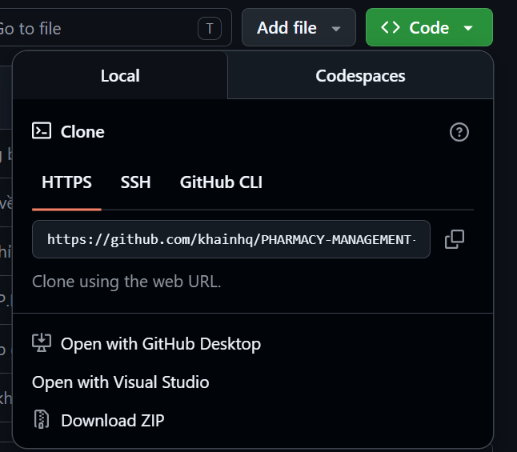
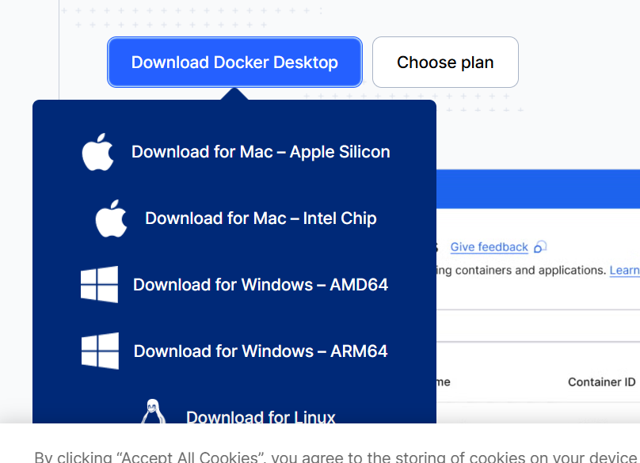
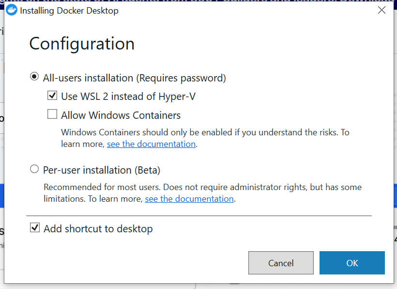
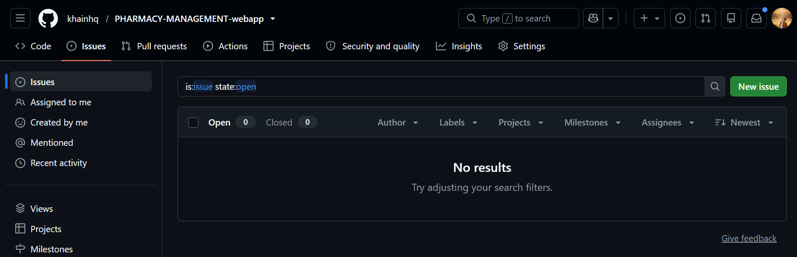

# PHARMACY-MANAGEMENT-webapp

Ứng dụng quản lý nhà thuốc PharmaCare gồm:

- Frontend: React
- Backend: ASP.NET Core Web API
- Database: Microsoft SQL Server
- Cách chạy khuyến nghị cho nhóm: Docker Desktop

README này dành cho thành viên nhóm chưa quen chạy project. Chỉ cần làm theo từng bước bên dưới.

## Link project

Repository GitHub:

```text
https://github.com/khainhq/PHARMACY-MANAGEMENT-webapp
```

## Tài khoản đăng nhập mẫu

| Tài khoản | Mật khẩu | Phân hệ |
| --- | --- | --- |
| `admin` | `admin123` | Quản trị hệ thống: xem dashboard, báo cáo, nhân viên, tài khoản và các chức năng quản lý chung |
| `sales` | `sales123` | Nhân viên bán hàng: dashboard bán hàng, khách hàng, hóa đơn |
| `product` | `product123` | Nhân viên quản lý sản phẩm/kho: thuốc, nhà cung cấp, phiếu nhập |

## Cách tải source code bằng Download ZIP

### Bước 1: Mở repo GitHub

Vào link project ở trên.

### Bước 2: Bấm nút Code

Bấm nút màu xanh `Code`, sau đó chọn `Download ZIP`.



### Bước 3: Giải nén file ZIP

Sau khi tải xong, vào thư mục `Downloads`, bấm chuột phải vào file ZIP và chọn `Extract All...` hoặc `Giải nén tất cả`.

Ví dụ sau khi giải nén, thư mục có thể nằm ở:

```text
C:\Users\<ten-may-cua-ban>\Downloads\PHARMACY-MANAGEMENT-webapp-master
```

Trong đó `<ten-may-cua-ban>` là tên user Windows trên máy của bạn.

## Cài Docker Desktop

Project này chạy bằng Docker để mọi người không phải tự cài riêng Node.js, .NET SDK hoặc SQL Server.

### Bước 1: Vào trang tải Docker

Mở link chính thức:

```text
https://docs.docker.com/desktop/setup/install/windows-install/
```

### Bước 2: Tải bản Windows AMD64

Chọn `Download for Windows - AMD64`.



### Bước 3: Cài Docker Desktop

Mở file vừa tải về. Ở màn hình cấu hình, có thể để các lựa chọn mặc định, giữ `Use WSL 2 instead of Hyper-V`, sau đó bấm `OK`.



### Bước 4: Khởi động lại máy nếu Docker yêu cầu

Nếu Docker yêu cầu restart, hãy khởi động lại máy.

### Bước 5: Mở Docker Desktop

Sau khi mở Docker Desktop, đợi đến khi Docker chạy ổn định. Nếu Docker hỏi đăng nhập thì có thể đăng nhập hoặc bỏ qua nếu Docker cho phép.

## Chạy project bằng CMD

### Bước 1: Mở CMD

Bấm `Windows + R`, nhập:

```text
cmd
```

Sau đó bấm `Enter`.

### Bước 2: Đi tới thư mục project đã giải nén

Nếu project nằm trong `Downloads`, chạy lệnh tương tự bên dưới.

Nhớ đổi `<ten-may-cua-ban>` thành tên user Windows trên máy bạn:

```cmd
cd /d "C:\Users\<ten-may-cua-ban>\Downloads\PHARMACY-MANAGEMENT-webapp-master"
```

Ví dụ:

```cmd
cd /d "C:\Users\Admin\Downloads\PHARMACY-MANAGEMENT-webapp-master"
```

Nếu bạn giải nén ở Desktop thì đường dẫn có thể là:

```cmd
cd /d "C:\Users\<ten-may-cua-ban>\Desktop\PHARMACY-MANAGEMENT-webapp-master"
```

### Bước 3: Build và chạy project

Chạy lệnh:

```cmd
docker compose up -d --build
```

Lần đầu chạy có thể mất vài phút vì Docker phải tải SQL Server, build backend và build frontend.

### Bước 4: Kiểm tra container

Chạy lệnh:

```cmd
docker compose ps
```

Nếu chạy đúng, bạn sẽ thấy các service tương tự:

- `frontend`
- `backend`
- `sqlserver`

Bạn cũng có thể mở Docker Desktop để xem container. Nếu container đang tắt, có thể bấm nút Start hình tam giác.


### Bước 5: Mở website

Mở trình duyệt và vào:

```text
http://localhost:3000
```

Backend chạy ở:

```text
http://localhost:8000
```

SQL Server chạy ở port:

```text
1433
```

## Đăng nhập vào hệ thống

Sau khi mở `http://localhost:3000`, bấm `Sign In`.

Dùng một trong các tài khoản mẫu:

```text
admin / admin123
sales / sales123
product / product123
```

Nếu đăng nhập bằng `sales`, hệ thống sẽ vào phân hệ bán hàng.

Nếu đăng nhập bằng `product`, hệ thống sẽ vào phân hệ quản lý sản phẩm/kho.

Nếu đăng nhập bằng `admin`, hệ thống sẽ vào phân hệ quản trị.

## Dừng project

Khi không dùng nữa, mở CMD trong thư mục project và chạy:

```cmd
docker compose down
```

## Chạy lại project ở lần sau

Lần sau chỉ cần mở Docker Desktop, mở CMD trong thư mục project và chạy:

```cmd
docker compose up -d
```

Sau đó mở lại:

```text
http://localhost:3000
```

## Xem log khi có lỗi

Nếu frontend, backend hoặc database không chạy, dùng các lệnh sau:

```cmd
docker compose logs frontend
```

```cmd
docker compose logs backend
```

```cmd
docker compose logs sqlserver
```

## Reset dữ liệu database

Nếu muốn xóa database cũ và tạo lại dữ liệu mẫu từ đầu:

```cmd
docker compose down -v
```

Sau đó chạy lại:

```cmd
docker compose up -d --build
```

Lưu ý: lệnh `docker compose down -v` sẽ xóa dữ liệu SQL Server đang lưu trong Docker volume.

## Một số lỗi thường gặp

### Lỗi Docker chưa chạy

Nếu CMD báo không kết nối được Docker, hãy mở Docker Desktop trước, đợi Docker chạy xong rồi chạy lại lệnh.

### Lỗi port 3000, 8000 hoặc 1433 đã được dùng

Nếu máy bạn đang có ứng dụng khác dùng các port này, hãy tắt ứng dụng đó rồi chạy lại:

```cmd
docker compose up -d
```

### Backend hoặc SQL Server khởi động chậm

SQL Server có thể cần thêm thời gian ở lần chạy đầu. Chờ khoảng 1 đến 3 phút rồi tải lại trang.

### Muốn build lại từ đầu

Chạy:

```cmd
docker compose down
docker compose up -d --build
```

## Góp ý và ghi chú lỗi

Một số chức năng trong project mới được gây dựng, chưa có test chức năng chi tiết cho toàn bộ nghiệp vụ.

Nếu mọi người gặp lỗi hoặc có góp ý, có thể:

1. Vào tab `Issues` trên GitHub để tạo issue.
2. Góp ý trực tiếp trên Zalo nhóm.
3. Sửa code hoặc bổ sung tính năng rồi commit/push nếu đã được cấp quyền.



Khi tạo issue, nên ghi rõ:

- Bạn đang đăng nhập bằng tài khoản nào.
- Bạn đang ở màn hình nào.
- Bạn đã bấm gì trước khi lỗi xảy ra.
- Ảnh chụp màn hình lỗi nếu có.

## Ghi chú cho thành viên được mời vào repo

Nhóm trưởng đã gửi lời mời collaborator trên GitHub. Mỗi thành viên cần mở GitHub và chấp nhận lời mời thì mới có quyền sửa code hoặc push lên repository.
